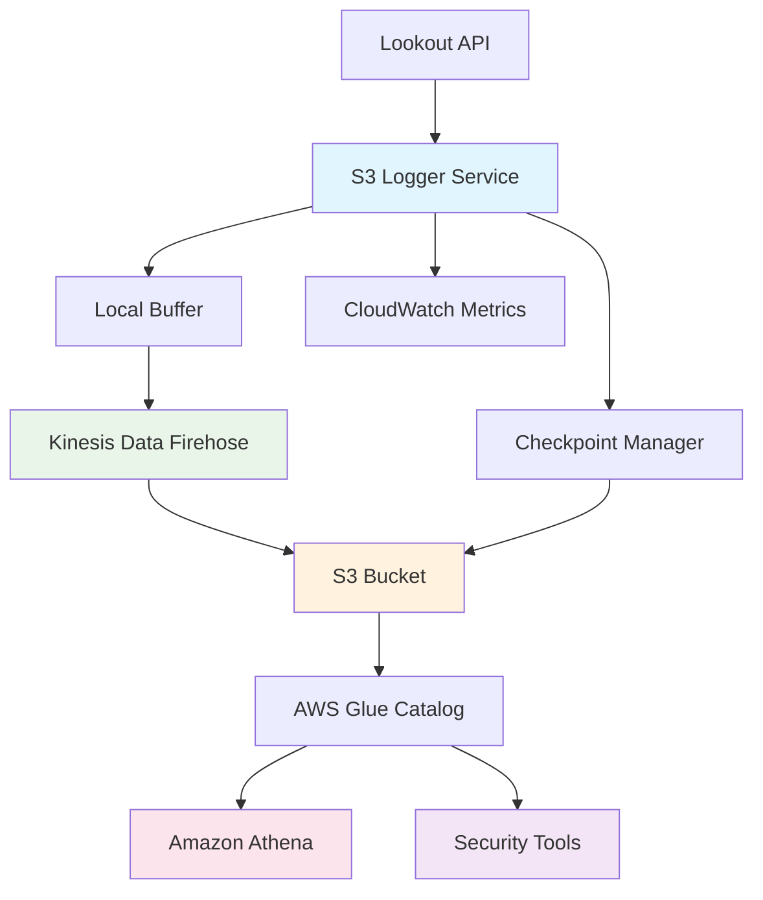

# Lookout Web Activity S3 Logger

A production-ready background service that continuously streams Lookout web activity events to Amazon S3 via Kinesis Data Firehose for security analytics and compliance logging.

## 🏗️ Architecture Overview



## 🚀 Features

- **Continuous Streaming**: Polls Lookout API every 5 minutes (configurable)
- **Intelligent Buffering**: Batches events for optimal S3 performance
- **State Management**: Checkpoint system prevents data loss/duplication
- **Auto-Partitioning**: Organizes data by year/month/day/hour for fast queries
- **Parquet Format**: 85% storage savings + faster analytics
- **Production Ready**: Comprehensive error handling, monitoring, and logging
- **Multiple Deployment Options**: Systemd service, Docker, or standalone

## 📊 S3 Data Structure

Data is automatically partitioned for optimal query performance:

```
s3://your-security-logs-bucket/
├── web-activity/
│   ├── year=2025/month=06/day=20/hour=15/
│   │   └── firehose_output_000000_20250620T150000Z.parquet
│   ├── year=2025/month=06/day=20/hour=16/
│   │   └── firehose_output_000001_20250620T160000Z.parquet
├── _checkpoints/
│   └── last_processed.json
└── errors/
    └── processing_errors.json
```

## 🛠️ Quick Setup

### 1. Install Dependencies

```bash
pip install -r requirements_s3.txt
```

### 2. Setup AWS Infrastructure

```bash
# Setup AWS resources automatically
python aws_setup.py \
  --bucket-name "your-company-lookout-logs" \
  --stream-name "lookout-web-activity-stream" \
  --region "us-east-1"
```

This creates:
- S3 bucket with lifecycle policies and encryption
- Kinesis Data Firehose stream with Parquet conversion
- IAM roles with minimal required permissions
- AWS Glue catalog for Athena queries

### 3. Configure Environment

Add to your `.env` file:

```bash
# Lookout Configuration
LOOKOUT_ACCESS_TOKEN=your_lookout_token

# AWS Configuration (from aws_setup.py output)
S3_BUCKET_NAME=your-company-lookout-logs
FIREHOSE_STREAM_NAME=lookout-web-activity-stream
AWS_REGION=us-east-1

# Service Configuration (optional)
POLL_INTERVAL=300          # 5 minutes
BUFFER_SIZE_LIMIT=500      # Events per batch
BUFFER_TIME_LIMIT=300      # Max 5 minutes between flushes
LOG_LEVEL=INFO
```

### 4. Run the Service

```bash
# Test run
python lookout_s3_logger.py

# Background service (systemd)
sudo cp systemd/lookout-s3-logger.service /etc/systemd/system/
sudo systemctl enable lookout-s3-logger
sudo systemctl start lookout-s3-logger

# Docker deployment
cd docker
docker-compose up -d
```

## 📈 Monitoring & Analytics

### CloudWatch Metrics

The service automatically sends metrics to CloudWatch:

- `LookoutS3Logger/EventsProcessed`: Number of events processed
- `LookoutS3Logger/ServiceHealth`: Service health indicator
- `LookoutS3Logger/Errors`: Error count

### Querying Data with Athena

Once data is flowing, query with SQL:

```sql
-- Recent web activity
SELECT 
    device_guid,
    timestamp,
    request_url,
    region
FROM lookout_security.web_activity
WHERE year = '2025' 
  AND month = '06' 
  AND day = '20'
ORDER BY timestamp DESC
LIMIT 100;

-- Top domains by device
SELECT 
    device_guid,
    regexp_extract(request_url, 'https?://([^/]+)', 1) as domain,
    count(*) as request_count
FROM lookout_security.web_activity
WHERE year = '2025' AND month = '06'
GROUP BY device_guid, regexp_extract(request_url, 'https?://([^/]+)', 1)
ORDER BY request_count DESC;

-- Suspicious activity detection
SELECT 
    device_guid,
    count(*) as request_count,
    count(DISTINCT regexp_extract(request_url, 'https?://([^/]+)', 1)) as unique_domains
FROM lookout_security.web_activity
WHERE year = '2025' AND month = '06' AND day = '20'
GROUP BY device_guid
HAVING request_count > 1000 OR unique_domains > 100
ORDER BY request_count DESC;
```

### Integration with Security Tools

#### Splunk Integration
```bash
# Add S3 data input in Splunk
# Configure AWS credentials and point to your S3 bucket
# Use the partition structure for efficient data loading
```

#### ELK Stack Integration
```bash
# Use Logstash S3 input plugin
input {
  s3 {
    bucket => "your-company-lookout-logs"
    prefix => "web-activity/"
    codec => "json"
  }
}
```

## 🔧 Configuration Options

### Environment Variables

| Variable | Default | Description |
|----------|---------|-------------|
| `LOOKOUT_ACCESS_TOKEN` | Required | Lookout API access token |
| `S3_BUCKET_NAME` | Required | S3 bucket for logs |
| `FIREHOSE_STREAM_NAME` | Required | Kinesis Firehose stream name |
| `AWS_REGION` | `us-east-1` | AWS region |
| `POLL_INTERVAL` | `300` | API polling interval (seconds) |
| `BUFFER_SIZE_LIMIT` | `500` | Max events per batch |
| `BUFFER_TIME_LIMIT` | `300` | Max time between flushes (seconds) |
| `LOG_LEVEL` | `INFO` | Logging level |
| `MAX_RETRIES` | `3` | Max retry attempts on failure |
| `RETRY_DELAY` | `60` | Delay between retries (seconds) |

### Advanced Configuration

For high-volume environments, tune these settings:

```bash
# High-volume configuration
POLL_INTERVAL=60           # Poll every minute
BUFFER_SIZE_LIMIT=1000     # Larger batches
BUFFER_TIME_LIMIT=120      # Flush every 2 minutes
```

## 🚨 Troubleshooting

### Common Issues

**1. AWS Permissions Error**
```bash
# Verify AWS credentials
aws sts get-caller-identity

# Check IAM permissions
aws iam simulate-principal-policy \
  --policy-source-arn arn:aws:iam::ACCOUNT:role/lookout-firehose-role \
  --action-names s3:PutObject \
  --resource-arns arn:aws:s3:::your-bucket/*
```

**2. Firehose Stream Not Active**
```bash
# Check stream status
aws firehose describe-delivery-stream \
  --delivery-stream-name lookout-web-activity-stream
```

**3. No Data in S3**
```bash
# Check service logs
journalctl -u lookout-s3-logger -f

# Verify API connectivity
python -c "
from lookout_s3_logger import LookoutS3Logger
logger = LookoutS3Logger()
events = logger.fetch_events()
print(f'Fetched {len(events)} events')
"
```

### Log Analysis

```bash
# Service logs
journalctl -u lookout-s3-logger -f

# Docker logs
docker logs lookout-s3-logger -f

# CloudWatch logs
aws logs tail /aws/kinesisfirehose/lookout-web-activity-stream --follow
```

## 💰 Cost Optimization

### S3 Lifecycle Policies

The setup automatically configures cost-effective storage:

- **0-30 days**: Standard storage (frequent access)
- **30-90 days**: Standard-IA (infrequent access)
- **90-365 days**: Glacier (archive)
- **365+ days**: Deep Archive (long-term retention)

### Estimated Costs (1000 devices, 100 events/device/day)

| Service | Monthly Cost |
|---------|-------------|
| S3 Storage (Standard) | ~$23 |
| S3 Storage (IA/Glacier) | ~$5 |
| Kinesis Data Firehose | ~$15 |
| AWS Glue Catalog | ~$1 |
| **Total** | **~$44/month** |

## 🔒 Security Best Practices

### IAM Permissions

The service uses minimal required permissions:

```json
{
  "Version": "2012-10-17",
  "Statement": [
    {
      "Effect": "Allow",
      "Action": [
        "s3:PutObject",
        "s3:GetObject",
        "s3:ListBucket"
      ],
      "Resource": [
        "arn:aws:s3:::your-bucket",
        "arn:aws:s3:::your-bucket/*"
      ]
    },
    {
      "Effect": "Allow",
      "Action": [
        "firehose:PutRecord",
        "firehose:PutRecordBatch"
      ],
      "Resource": "arn:aws:firehose:region:account:deliverystream/stream-name"
    }
  ]
}
```

### Data Encryption

- **In Transit**: HTTPS for all API calls
- **At Rest**: S3 server-side encryption (AES-256)
- **Processing**: Encrypted Firehose delivery

### Network Security

- Deploy in private subnets
- Use VPC endpoints for AWS services
- Implement security groups with minimal access

## 📚 API Reference

### Event Schema

Each event in S3 contains:

```json
{
  "event_id": "evt_12345",
  "device_guid": "abc-123-def-456",
  "timestamp": "2025-06-20T15:30:00Z",
  "request_url": "https://example.com/page",
  "region": "US",
  "user_agent": "Mozilla/5.0...",
  "response_code": 200,
  "bytes_transferred": 1024,
  "ingestion_time": "2025-06-20T15:31:05Z",
  "partition_date": "2025-06-20"
}
```

### Service Management

```bash
# Start service
sudo systemctl start lookout-s3-logger

# Stop service
sudo systemctl stop lookout-s3-logger

# Check status
sudo systemctl status lookout-s3-logger

# View logs
journalctl -u lookout-s3-logger -f

# Restart service
sudo systemctl restart lookout-s3-logger
```

## 🤝 Contributing

1. Fork the repository
2. Create a feature branch
3. Add tests for new functionality
4. Submit a pull request

## 📄 License

This project is licensed under the MIT License - see the LICENSE file for details.

## 🆘 Support

For issues and questions:

1. Check the troubleshooting section above
2. Review CloudWatch logs and metrics
3. Open an issue with detailed logs and configuration
4. Contact your security team for access-related questions

---

**Security Note**: This service handles sensitive web activity data. Ensure proper access controls, encryption, and compliance with your organization's data governance policies.
